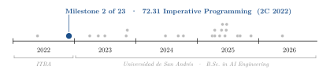
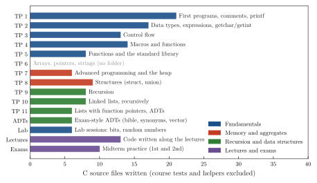
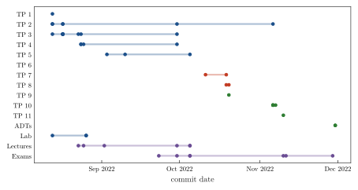

<div align="center">

# Imperative Programming in C: A Semester of Exercises, Labs and ADTs

**Santiago Groba Alonso**

Instituto Tecnológico de Buenos Aires (ITBA) · *72.31 Imperative Programming* · Second semester 2022 · Course notes and practice

[](#reproducing-the-results)
[](#reproducing-the-results)

<picture>
  <source media="(prefers-color-scheme: dark)" srcset="docs/figures/trajectory-dark.svg">
  
</picture>

</div>

> **Abstract.** This repository is my working log for ITBA's *Imperative Programming* (72.31), a first-year programming course taught in C. It holds 146 C source files written between August and November 2022: solutions to ten of the eleven practice guides (TPs), lab sessions, code typed along the lectures, practice for the two midterms and exam-style abstract data types. The material climbs from `printf` and control flow to macros, the standard library, the heap, structures, recursion, linked lists and opaque ADTs. Re-running the course's `assert`-based test programs against my solutions in this session, 9 of 10 pass; the remaining one fails to link because the second variant of the exercise was never written. The log is kept as it was during the semester, including drafts that do not compile.

---

## 1. Course

*Imperative Programming* is a first-year course at ITBA. It teaches structured programming in ANSI C: types and expressions, control flow, functions and modular design, the preprocessor, the standard library, arrays, pointers and strings, dynamic memory, structures, recursion and, at the end, abstract data types implemented as opaque pointers (`typedef struct xCDT * xADT`). Each unit comes with a practice guide (*Guía de TP*); from TP 4 on, some exercises ship with a test program built on `assert`, and the guides cap the number of lines each solution should take to encourage concise code.

## 2. Contents

**Table 1.** Map of the repository. Topics of TP 3 to TP 8 are the titles of the guides kept in `pdfs/`; the others are inferred from the solutions.

| Folder | Unit | Topic | Highlights |
|---|---|---|---|
| `guia_1/` | TP 1 | First programs | comments, `printf` formats, small arithmetic programs |
| `guia_2/` | TP 2 | Data types and expressions | time conversions, `getchar`/`getint` input |
| `guia_3/` | TP 3 | Control flow | character filters on `stdin`, loops |
| `guia_4/` | TP 4 | Macros and functions | GCD, macros (`swap`, `DIVISOR`, `ESFERA`), function design |
| `guia_5/` | TP 5 | Functions and the standard library | variable scope and lifetime, `<math.h>` |
| — | TP 6 | Arrays, pointers and strings | statement in `pdfs/TP_06.pdf`, no solutions folder |
| `guia_7/` | TP 7 | Advanced programming and the heap | `malloc`/`free`, hangman and bingo games, names split by course |
| `guia_8/` | TP 8 | Structures | `struct`, `union`, fixing heap misuse |
| `guia_9/` | TP 9 | Recursion | recursive sums, dot product, binary search, string functions |
| `guia_10/` | TP 10 | Linked lists | recursive sum, ordering, union and intersection, run-length compression |
| `guia_11/` | TP 11 | Lists and ADTs | `removeIf` with function pointers, `listADT`, `vectorADT` |
| `TADS/` | ADTs | Exam-style ADTs | `bibleADT`, synonym dictionary, generic vector |
| `Lab/` | Labs | Lab sessions | bit masks, pseudo-random numbers, amicable numbers |
| `clases/` | Lectures | Code from the lectures | `scanf`, string vectors, heap, `struct` (slides `Pi_13`–`Pi_15`) |
| `parciales/` | Exams | Midterm practice | first and second midterm exercises, a 2017 exam |

<p align="center"></p>

**Figure 1.** C source files I wrote per folder (146 in total), excluding the test programs and helper libraries handed out by the course (`*_test.c`, `getnum`, `utillist`). Early guides have many short exercises; later ones have fewer, longer ones.

<p align="center"></p>

**Figure 2.** When each folder was worked on: one dot per commit that touched it, from `git log`. The guides were followed roughly in order, with midterm practice in late September and November and the ADT exercises at the end of the semester.

## 3. Results

The course's test programs link a `main` full of `assert`s against the student's functions and print `OK!` when every check passes. I rebuilt them against the solutions in this repository with `gcc -std=c99 -Wall` (AddressSanitizer, which TP 7 recommends, was not available on the machine used).

**Table 2.** Course test programs and self-checking exercises, run in this session.

| Unit | Exercise | Functions under test | Result |
|---|---|---|---|
| TP 7 | 5 | `separaCursos` | pass |
| TP 10 | 1 | `sumAll`, `odds1`, `odds2` | pass |
| TP 10 | 3, 4, 5, 7, 8, 9 | recursive list operations | pass (6/6) |
| TP 10 | 6 | `deleteDupl`, `deleteDupl2` | does not link: `deleteDupl2` not written |
| TP 11 | 1 | `removeIf` with predicates | pass |
| ADTs | `bible.c` | `bibleADT` (add and get verses) | pass |
| ADTs | `bible2.c` | second version of `bibleADT` | assertion fails on a duplicate verse |
| ADTs | `dicSynADT.c` | synonym dictionary | does not compile (draft; includes a missing `synADT.h`) |

Nine of the ten course-provided tests pass. The ADT folder is closer to a scratchpad from the last week before the final: one implementation passes its checks and two are unfinished.

## 4. Takeaways

- Writing every solution against a line budget and an `assert` harness was my first contact with specification-driven code: the test file is the specification.
- The jump from TP 7 to TP 11 (heap, then recursive lists, then opaque ADTs) is where C stopped being syntax and became about ownership: who allocates, who frees, and what the caller is allowed to see.
- Recursion on linked lists (TP 10) turned out to be the shortest path to correct list code: a base case for the empty list and one recursive call on the tail.

## Reproducing the results

```bash
# Course test programs (TP 10 shown; TP 7 and TP 11 work the same way)
cd guia_10
for n in 1 3 4 5 6 7 8 9; do
  gcc -std=c99 -Wall tp10_ej${n}_test.c $n.c utillist.c -o ej$n.out && ./ej$n.out
done
cd ../guia_7  && gcc -std=c99 -Wall tp07_ej5_test.c 5.c -o ej5.out && ./ej5.out
cd ../guia_11 && gcc -std=c99 -Wall test1.c 1.c utillist.c -o ej1.out && ./ej1.out
cd ../TADS    && gcc -std=c99 -Wall bible.c -o bible.out && ./bible.out

# Figures (run inside the clone; uses git log)
pip install matplotlib
python docs/figures/make_figures.py
```

| File | Content |
|---|---|
| `guia_1/` … `guia_11/` | Solutions to the practice guides (TP 6 has none) |
| `Lab/`, `clases/`, `parciales/`, `TADS/` | Labs, lecture code, midterm practice, exam-style ADTs |
| `pdfs/` | Guide statements TP 3–TP 8 and the course test programs for TP 7 and TP 8 (Spanish) |
| `getnum.c`, `getnum.h`, `rand.c`, `rand.h` | Input and random-number helpers used across guides |
| `AlgThink/Intro/FoodLines.c` | A warm-up problem outside the course guides |
| `docs/figures/` | Script and style used for the figures in this README |

## Acknowledgements

Guide statements, slides, test programs and the `getnum` and `utillist` helpers are course material from the teaching staff of 72.31 Imperative Programming at ITBA.

## Citation

```bibtex
@misc{groba2022imperative,
  author       = {Groba Alonso, Santiago},
  title        = {Imperative Programming in C: A Semester of Exercises, Labs and ADTs},
  year         = {2022},
  howpublished = {Instituto Tecnol{\'o}gico de Buenos Aires, 72.31 Imperative Programming},
  url          = {https://github.com/Santi2065/imperative-programming-c}
}
```
